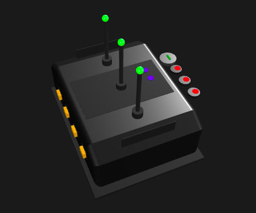

# 3D Router Model Viewer

An interactive 3D product viewer built with Three.js, showcasing a sleek and futuristic router design created using advanced geometric shapes and realistic materials.

## Features

- Interactive 3D model viewing
- Automatic camera rotation
- Mouse interaction with model parts
- Responsive design
- Realistic lighting and materials
- Dynamic LED lighting and detailed components

## Screenshot



## Tech Stack

- Three.js
- Vite
- JavaScript/ES6+

## Setup

To get this project up and running on your local machine, follow these steps:

1.  **Clone the repository:**
    ```bash
    git clone [your-repo-url] # Replace with your actual repository URL
    ```

2.  **Navigate into the project directory:**
    ```bash
    cd graphics # Assuming 'graphics' is the folder name
    ```

3.  **Install dependencies:**
    ```bash
    npm install
    ```

4.  **Run development server:**
    ```bash
    npm run dev
    ```

5.  **Open your browser and navigate to the port indicated in your terminal.**

## Project Structure

```
project/
├── src/
│   ├── components/    # Three.js components (e.g., router parts, lighting, interaction)
│   ├── styles/        # CSS styles
│   └── main.js        # Entry point for Three.js scene setup and animation
├── public/            # Static assets
└── index.html         # Main HTML file
```
